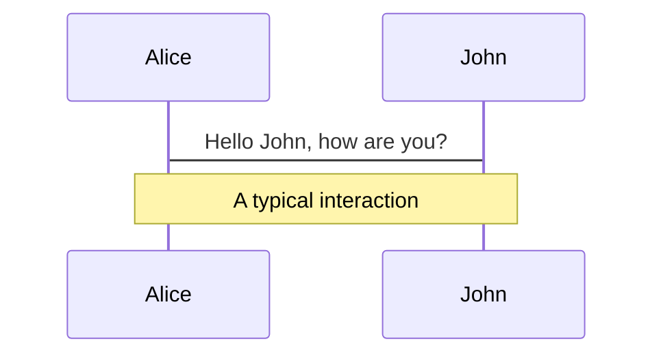
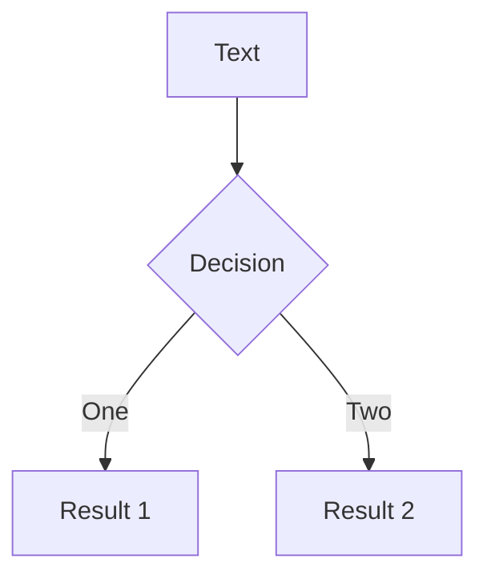
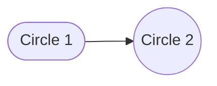

# This is the title of the talk

## This is a subtitle


---
layout: default
---

# Extras

In addition to these custom layouts, the **Neversink** theme includes a few custom components that can be used in your slides. These include sticky notes, speech bubbles, cute icons, QR codes, and more.  The next few slides walks through them:

<div class="ns-c-tight">

- admonitions
- sticky notes
- speech bubbles
- cute icons
- QR codes
</div>

::footnotes{separator}

  :::footnote{number=1}
  A footnote
  :::
  :::footnote{number=2}
  [Picsum]("https://picsum.photos/")
  :::
::


---
layout: section
sectionNumber: 2
---

# This is a new section

## This is a subtitle that is also really really long, look at this

### And another subsubtitle

---
layout: two-cols
---

# Extras

I want to be out

:: footnotes{separator}
  ::: footnote{number=3}
  Another one
  :::
::


:: left ::

In addition to these custom layouts, the **Neversink** theme includes a few custom components that can be used in your slides. These include sticky notes, speech bubbles, cute icons, QR codes, and more.  The next few slides walks through them:

```python
import stuff as stf
what = 5
```

:: footnotes
  ::: footnote{number=1}
  Hello
  :::

::

:: right ::

## What is this?

A second columns.

:: footnotes
  ::: footnote{number=2}
  Hello again
  :::
::

---
layout: default
---

# Extras

In addition to these custom layouts, the **Neversink** theme includes a few custom components that can be used in your slides. These include sticky notes, speech bubbles, cute icons, QR codes, and more.  The next few slides walks through them:

```python
import stuff as stf
what = 5
```


---
layout: default
color: amber
align : rm-lm
---

# Slidev Neversink Theme

Neversink is theme for education and academic presentations.  It is designed to be bright, flat, minimal, and easy to read.  It is based on the default Slidev theme but with some additional features and color schemes that have reference in the [metropolis](https://github.com/matze/mtheme) Beamer theme among others.

It is named for the [Neversink River](https://en.wikipedia.org/wiki/Neversink_River) for absolutely no discernable reason.

---
layout: default
---

# Why use it?

- Neversink has several configurable ==layouts== that build upon the Slidev defaults and which make it easier to quickly throw together common slide layouts without having to write a lot of custom CSS/HTML.

- It has a variety of ==color themes== to choose from that make your visual identity more coherent. 


- It also has some whimsical elements like movie-style scrolling credits, animated speech bubbles, and admonitions that make your presentations more memorable.

- It strives to be well documented and easy to use! 


 You can find the source code on [GitHub](http://github.com/gureckis/slidev-theme-neversink).

---
layout: default
---

# How to install


The theme depends on Slidev.  So you need to have that [installed first](https://sli.dev/guide/install).  Then you can install the theme with npm:

```bash
npm install slidev-theme-neversink
```

Then create a slidev markdown file (e.g., `slides.md`) and add the theme to the frontmatter of your first slide:

```md
---
theme: neversink
---
```

Then you are basically ready to go!


---
layout: default
---

# Color schemes


Let's start with colors.  

The project uses tailwind-like color schemes arranged in ==monochromatic pairs==. These boxes show the options and names:

**B&W**:

<div class="leading-[1.5em]">
<span class="text-white bg-black p-1 pl-3 pr-3 m-1 rounded font-size-3">black</span>
<span class="text-black bg-white border-1 border-solid border-black p-1 pl-3 pr-3 m-1 rounded font-size-3">white</span>
<span class="text-gray-100 bg-gray-800 p-1 pl-3 pr-3 m-1 rounded font-size-3">dark</span>
<span class="text-gray-800 bg-gray-100 p-1 pl-3 pr-3 m-1 rounded font-size-3">light</span>

</div>

**Light**:

<div class="leading-[1.5em]">
<span class="bg-slate-100 text-slate-500 p-1 pl-3 pr-3 m-1 rounded font-size-3">slate-light</span>
<span class="bg-gray-100 text-gray-500 p-1 pl-3 pr-3 m-1 rounded font-size-3">gray-light</span>
<span class="bg-zinc-100 text-zinc-500 p-1 pl-3 pr-3 m-1 rounded font-size-3">zinc-light</span>
<span class="bg-neutral-100 text-neutral-500 p-1 pl-3 pr-3 m-1 rounded font-size-3">neutral-light</span>
<span class="bg-stone-100 text-stone-500 p-1 pl-3 pr-3 m-1 rounded font-size-3">stone-light</span>
<span class="bg-red-100 text-red-500 p-1 pl-3 pr-3 m-1 rounded font-size-3">red-light</span>
<span class="bg-orange-100 text-orange-500 p-1 pl-3 pr-3 m-1 rounded font-size-3">orange-light</span>
<span class="bg-amber-100 text-amber-500 p-1 pl-3 pr-3 m-1 rounded font-size-3">amber-light</span>
<span class="bg-yellow-100 text-yellow-500 p-1 pl-3 pr-3 m-1 rounded font-size-3">yellow-light</span><br />
<span class="bg-lime-100 text-lime-500 p-1 pl-3 pr-3 m-1 rounded font-size-3">lime-light</span>
<span class="bg-green-100 text-green-500 p-1 pl-3 pr-3 m-1 rounded font-size-3">green-light</span>
<span class="bg-emerald-100 text-emerald-500 p-1 pl-3 pr-3 m-1 rounded font-size-3">emerald-light</span>
<span class="bg-teal-100 text-teal-500 p-1 pl-3 pr-3 m-1 rounded font-size-3">teal-light</span>
<span class="bg-cyan-100 text-cyan-500 p-1 pl-3 pr-3 m-1 rounded font-size-3">cyan-light</span>
<span class="bg-sky-100 text-sky-500 p-1 pl-3 pr-3 m-1 rounded font-size-3">sky-light</span>
<span class="bg-blue-100 text-blue-500 p-1 pl-3 pr-3 m-1 rounded font-size-3">blue-light</span>
<span class="bg-indigo-100 text-indigo-500 p-1 pl-3 pr-3 m-1 rounded font-size-3">indigo-light</span>
<span class="bg-violet-100 text-violet-500 p-1 pl-3 pr-3 m-1 rounded font-size-3">violet-light</span><br />
<span class="bg-purple-100 text-purple-500 p-1 pl-3 pr-3 m-1 rounded font-size-3">purple-light</span>
<span class="bg-pink-100 text-pink-500 p-1 pl-3 pr-3 m-1 rounded font-size-3">pink-light</span>
<span class="bg-rose-100 text-rose-500 p-1 pl-3 pr-3 m-1 rounded font-size-3">rose-light</span>
<span class="bg-fuchsia-100 text-fuchsia-500 p-1 pl-3 pr-3 m-1 rounded font-size-3">fuchsia-light</span>
<span class="bg-gray-50 text-navy-900 p-1 pl-3 pr-3 m-1 rounded font-size-3">navy-light</span>
</div>

**Regular**:

<div class="leading-[1.5em]">
<span class="bg-slate-500 text-slate-100 p-1 pl-3 pr-3 m-1 rounded font-size-3">slate</span>
<span class="bg-gray-500 text-gray-100 p-1 pl-3 pr-3 m-1 rounded font-size-3">gray</span>
<span class="bg-zinc-500 text-zinc-100 p-1 pl-3 pr-3 m-1 rounded font-size-3">zinc</span>
<span class="bg-neutral-500 text-neutral-100 p-1 pl-3 pr-3 m-1 rounded font-size-3">neutral</span>
<span class="bg-stone-500 text-stone-100 p-1 pl-3 pr-3 m-1 rounded font-size-3">stone</span>
<span class="bg-red-500 text-red-100 p-1 pl-3 pr-3 m-1 rounded font-size-3">red</span>
<span class="bg-orange-500 text-orange-100 p-1 pl-3 pr-3 m-1 rounded  font-size-3">orange</span>
<span class="bg-amber-500 text-amber-100 p-1 pl-3 pr-3 m-1 rounded font-size-3">amber</span>
<span class="bg-yellow-500 text-yellow-100 p-1 pl-3 pr-3 m-1 rounded font-size-3">yellow</span>
<span class="bg-lime-500 text-lime-100 p-1 pl-3 pr-3 m-1 rounded font-size-3">lime</span>
<span class="bg-green-500 text-green-100 p-1 pl-3 pr-3 m-1 rounded font-size-3">green</span>
<span class="bg-emerald-500 text-emerald-100 p-1 pl-3 pr-3 m-1 rounded font-size-3">emerald</span>
<span class="bg-teal-500 text-teal-100 p-1 pl-3 pr-3 m-1 rounded font-size-3">teal</span>
<span class="bg-cyan-500 text-cyan-100 p-1 pl-3 pr-3 m-1 rounded font-size-3">cyan</span><br/>
<span class="text-gray-300 bg-navy-900 p-1 pl-3 pr-3 m-1 rounded font-size-3">navy</span>
<span class="bg-sky-500 text-sky-100 p-1 pl-3 pr-3 m-1 rounded font-size-3">sky</span>
<span class="bg-blue-500 text-blue-100 p-1 pl-3 pr-3 m-1 rounded font-size-3">blue</span>
<span class="bg-indigo-500 text-indigo-100 p-1 pl-3 pr-3 m-1 rounded font-size-3">indigo</span>
<span class="bg-violet-500 text-violet-100 p-1 pl-3 pr-3 m-1 rounded font-size-3">violet</span>
<span class="bg-purple-500 text-purple-100 p-1 pl-3 pr-3 m-1 rounded font-size-3">purple</span>
<span class="bg-pink-500 text-pink-100 p-1 pl-3 pr-3 m-1 rounded font-size-3">pink</span>
<span class="bg-rose-500 text-rose-100 p-1 pl-3 pr-3 m-1 rounded font-size-3">rose</span>
<span class="bg-fuchsia-500 text-fuchsia-100 p-1 pl-3 pr-3 m-1 rounded font-size-3">fuchsia</span>
</div>

---
layout: default
---

# Color schemes

In many parts of the theme you can use the color schemes to help choose matching colors for your slides.  For example, we can make a slide with a sticky note using the `rose-light` color scheme, the `sky` color scheme, or the `amber-light` color scheme:

<StickyNote color="rose-light" textAlign="left" width="180px" v-drag="[122,253,180,180,-14]">

Hello, I'm a **redish sticky note** using `rose-light`.
</StickyNote>

<StickyNote color="sky" textAlign="left" width="180px"  v-drag="[389,251,180,180,9]">

Hello, I'm a **blueish sticky note** using `sky`.
</StickyNote>


<StickyNote color="amber-light" textAlign="left" width="180px"  v-drag="[650,253,180,180,-9]">

Hello, I'm a **yellowish sticky note** using `amber-light`.
</StickyNote>


---
layout: default
---

# This is the `default` layout

This is kind of the basic slide.  The main content is interpreted as markdown and rendered in the center of the slide.  

Speaking of markdown, you can use markdown to make things **bold** or *italic* or even `code` like `this`.  In **Neversink** you can also ==highlight things using the double equals signs like this==
thanks to the `markdown-it-mark` plugin.

Of course you can make bullet lists:

- Hi
- There

Also there's a little helper class `ns-c-tight` you can add to make the bullet spacing a bit tighter:

<div class="ns-c-tight">

- Hi
- There
- I need space
</div>


---
layout: default
color: sky
---

# The `default` layout 

The default layout also has an optional `color` option in the frontmatter.
For example this is

```md
---
layout: default
color: sky
---
```


---
layout: default
color: light
---

# The `default` layout 

Things don't have to be so dramatic.  For more conservative presentations you can use color schemes like `light`:

```md
---
layout: default
color: light
---
```

And of course you don't have to change the color scheme every slide! 

---
layout: default
---

# Extras

In addition to these custom layouts, the **Neversink** theme includes a few custom components that can be used in your slides. These include sticky notes, speech bubbles, cute icons, QR codes, and more.  The next few slides walks through them:

<div class="ns-c-tight">

- admonitions
- sticky notes
- speech bubbles
- cute icons
- QR codes
</div>


---
layout: two-cols
columns: is-6
title: Admonitions
dragPos:
  admon: Left,Top,Width,Height,Rotate
  "'admon'": 55,300,287,106
---

<!-- <Admonition title="V-draggable" color='teal-light' width="300px" v-drag="[93,303,300,145,-14]">
If you want to `v-drag` an admonition, you should set the width to a fixed value.
</Admonition> -->

# Admonitions

:: left ::

- Admonitions are boxes that you can use to call out things.

<Admonition title="Custom title" color='amber-light'>
This is my admon message
</Admonition>

:: right ::

<AdmonitionType type='note' >
This is note text
</AdmonitionType>

<!--
> [!note]
> This is note text
-->

<AdmonitionType type='important' >
This is important text
</AdmonitionType>

<AdmonitionType type='tip' >
This is a tip
</AdmonitionType>

<AdmonitionType type='warning' >
This is a tip
</AdmonitionType>

<AdmonitionType type='caution' >
This is warning text
</AdmonitionType>

---
layout: two-cols
columns: is-6
title: Bubbles
---

<SpeechBubble position="l" color='sky' shape="round"  v-drag="[83,364,274,109]">

Hello, I'm a **speech bubble**! I'm a longer speech bubble. I'm still going.
</SpeechBubble>

# Bubbles

:: left ::

- Bubbles are moveable elements that act as speech bubbles
- They can be configured for where you want the arrow to point
- The can be move around if you enable `v-drag` on the element

:: right ::

<SpeechBubble position="bl" color='amber-light' shape="round">

Hello, I'm a **speech bubble**! I'm a longer speech bubble. I'm still going.
Hello, I'm a **speech bubble**! I'm a longer speech bubble. I'm still going.
Hello, I'm a **speech bubble**! I'm a longer speech bubble. I'm still going.
</SpeechBubble>

---
layout: default
title: Sticky Notes
---

<StickyNote color="amber-light" textAlign="left" width="180px" title="Title" v-drag="[71,308,185,171]">

Hello, I'm a **sticky note**.
</StickyNote>

<StickyNote color="sky-light" textAlign="left" width="180px" title="This is my title" v-drag="[494,170,180,180,-15]">

Hello, I'm also a **sticky note** but am blue sky title.
</StickyNote>

<StickyNote color="pink-light" textAlign="left" width="180px"  v-drag="[707,277,185,171,8]">

Hello, I'm also a **sticky note** but I lack a title.
</StickyNote>

# Sticky Notes

- Sticky notes are moveable elements you can use for notes.
- Syntax is

```js
<StickyNote color="amber-light" textAlign="left" width="180px" title="Title" v-drag>
  Hello, I'm a **sticky note**.
</StickyNote>
```

---
layout: default
title: Kawaii 1
---

# Kawaii

- Kawaii is a Japanese term that means cute

<IceCream :size="80" mood="sad" color="#FDA7DC" />
<IceCream :size="80" mood="shocked" color="#FDA7DC" />
<IceCream :size="80" mood="happy" color="#FDA7DC" />
<IceCream :size="80" mood="blissful" color="#FDA7DC" />
<IceCream :size="80" mood="lovestruck" color="#FDA7DC" />
<IceCream :size="80" mood="excited" color="#FDA7DC" />
<IceCream :size="80" mood="ko" color="#FDA7DC" /><br/>

<BackPack :size="80" mood="sad" color="#FFD882" />
<BackPack :size="80" mood="shocked" color="#FFD882" />
<BackPack :size="80" mood="happy" color="#FFD882"/>
<BackPack :size="80" mood="blissful" color="#FFD882" />
<BackPack :size="80" mood="lovestruck" color="#FFD882" />
<BackPack :size="80" mood="excited" color="#FFD882" />
<BackPack :size="80" mood="ko" color="#FFD882" /><br/>

<Cat :size="80" mood="sad" color="#FFD882" />
<Cat :size="80" mood="shocked" color="#FFD882" />
<Cat :size="80" mood="happy" color="#FFD882"/>
<Cat :size="80" mood="blissful" color="#FFD882" />
<Cat :size="80" mood="lovestruck" color="#FFD882" />
<Cat :size="80" mood="excited" color="#FFD882" />
<Cat :size="80" mood="ko" color="#FFD882" /><br/>

<Browser :size="50" mood="lovestruck" color="#61DDBC" />
<Mug :size="50" mood="lovestruck" color="#61DDBC" />
<Planet :size="50" mood="lovestruck" color="#61DDBC" />
<SpeechBubbleGuy :size="50" mood="lovestruck" color="#d3d3d3" />
<Ghost :size="50" mood="blissful" color="#E0E4E8" />
<CreditCard :size="50" mood="blissful" color="#E0E4E8" />

---
layout: default
---

# In-line QR Codes

- Send people to a url with a easy to configure QR code

```vue
<QRCode value="https://gureckislab.org" :size="200" render-as="svg" />
```

<br />
Result:

<QRCode value="https://gureckislab.org" :size="200" render-as='svg'/>


---
layout: default
title: Lines
---

# Lines

<Line :x1=0 :y1=0 :x2=200 :y2=200 :width=2 color='red' v-drag="[326,136,250,250]" />

---
layout: default
side: left
color: violet
align: rm-lt
---

# Code example

<SpeechBubble position="br" shape="round" borderWidth="0" animation="float" v-drag="[615,37,261,83]">

Slidev is great at code formatting!
</SpeechBubble>

# <mdi-code-braces /> Code

<IceCream :size="80" mood="excited" color="#FDA7DC" v-drag="[828,140,50,80]" />


Plain javascript:

```js
console.log('Hello, World!')
```

Highlight lines 2 and 3:

```ts {2,3}
function helloworld() {
  console.log('Hello, World!')
  console.log('Hello, World!')
  console.log('Hello, World!')
}
```

Crazy clicking through

```ts {2,3|5|all}
function helloworld() {
  console.log('Hello, World!')
  console.log('Hello, World!')
  console.log('Hello, World!')
  console.log('Hello, World!')
  console.log('Hello, World!')
  console.log('Hello, World!')
}
```

---
layout: default
side: left
color: violet
align: rm-lt
title: Code Example
---

# Code Example


# <mdi-code-braces /> Code

More cool code stuff

Scrollable with clicks 🤯

```ts {2|3|7|12}{maxHeight:'100px'}
function helloworld() {
  console.log('Hello, World 1!')
  console.log('Hello, World 2!')
  console.log('Hello, World 3!')
  console.log('Hello, World 4!')
  console.log('Hello, World 5!')
  console.log('Hello, World 6!')
  console.log('Hello, World 7!')
  console.log('Hello, World 8!')
  console.log('Hello, World 9!')
  console.log('Hello, World 10!')
  console.log('Hello, World 11!')
}
```

You can even edit the code in the browser

```ts {monaco}
console.log('HelloWorld')
```

You can even run the code in the browser

```ts {monaco-run} {showOutputAt:'+1'}
function distance(x: number, y: number) {
  return Math.sqrt(x ** 2 + y ** 2)
}
console.log(distance(3, 4))
```

---
layout: default
side: left
color: lime
align: rm-lt
title: LaTeX Example
---

# LaTeX Example

# <mdi-math-integral-box /> LaTeX Equations

Yeah it does this fine

<Mug :size="80" mood="excited" color="#FDA7DC" v-drag="[784,126,77,80]" />


Inline equations: $\sqrt{3x-1}+(1+x)^2$

Block rendering:
$$
\begin{array}{c}

\nabla \times \vec{\mathbf{B}} -\, \frac1c\, \frac{\partial\vec{\mathbf{E}}}{\partial t} &
= \frac{4\pi}{c}\vec{\mathbf{j}}    \nabla \cdot \vec{\mathbf{E}} & = 4 \pi \rho \\

\nabla \times \vec{\mathbf{E}}\, +\, \frac1c\, \frac{\partial\vec{\mathbf{B}}}{\partial t} & = \vec{\mathbf{0}} \\

\nabla \cdot \vec{\mathbf{B}} & = 0

\end{array}
$$

Line highlighting with clicks!

$$
{1|3|all}
\begin{array}{c}
\nabla \times \vec{\mathbf{B}} -\, \frac1c\, \frac{\partial\vec{\mathbf{E}}}{\partial t} &
= \frac{4\pi}{c}\vec{\mathbf{j}}    \nabla \cdot \vec{\mathbf{E}} & = 4 \pi \rho \\
\nabla \times \vec{\mathbf{E}}\, +\, \frac1c\, \frac{\partial\vec{\mathbf{B}}}{\partial t} & = \vec{\mathbf{0}} \\
\nabla \cdot \vec{\mathbf{B}} & = 0
\end{array}
$$

---
layout: default
side: left
color: sky
titlewidth: is-4
align: rm-cm
---

# Mermaid Diagrams


Everyone is talking about this




---
layout: default
side: left
color: sky
align: rm-cm
title: Mermaid Example
---

# Mermaid Diagrams


Everyone is talking about this



A mermaid diagram with two circles side by side horizontally with an arrow pointing from the left circle to the right circle



---
layout: quote
color: indigo-light
quotesize: text-xl
authorsize: text-sm
author: "Todd Gureckis"
---

"This is a quote slide.  It has a frontmatter option of `quote` which is the text that appears in the quote box and `author` and options for the size of the text(`quotesize: text-2xl` and `authorsize: text-l`).  I feel it is a little uninspired but might save you some time."


---
layout: full
title: Full Layout
color: light
---

<div class='border-1px v-full h-full p-5'>

This is `layout: full` which fills the whole screen for the most part.
The grey box is just showing you the full addressable space.
Full can be useful for arbitrary layouts such as on the next slide which uses
the `v-drag` directive to position elements.

</div>

---
layout: full
title: Full with Arbitrary Layout
---

<div class='v-full h-full'>

<SpeechBubble position="l" shape="round"  color='pink-light' v-drag="[555,342,274,58]">

Hello, I'm an **ice cream**!
</SpeechBubble>

<SpeechBubble position="bl" shape="round"  color='emerald-light' v-drag="[445,258,274,57]">

Hello, I'm **kawaii**.
</SpeechBubble>

<SpeechBubble position="r" shape="round" animation="float"  color='sky' v-drag="[143,391,274,84]">

I'm v-dragged out and ==floating==.
</SpeechBubble>

<IceCream :size="150" mood="lovestruck" color="#FDA7DC" v-drag="[439,341,85,150]" />

<div class="ns-c-tight" v-drag="[143,33,277,214]">

<span class="bg-red-100 text-red-600 p-2 border-l-6 border-2 border-red-200 rounded-lg pl-4 pr-4">Here's a list of somethings</span>

- Novelty bonuses
- Cumulative prediction error
- Learning progress
- Surprise
- Suspense
- Information gain

</div>

<div class="ns-c-tight" v-drag="[461,63,293,148,17]">

<span class="bg-emerald-100 text-emerald-500 p-2 border-l-6 border-2 border-emerald-200 rounded-lg pl-4 pr-4">Here's another list of things</span>

- Structured behaviors
- Compositional
- Communicable

</div>

</div>


---
layout: full
title: Full Layout - 2 Col Fig
---

This is an example of using unocss atomic classes to put two figures side by side.

<div class="grid w-full h-fit grid-cols-2 grid-rows-2 mt-10 mb-auto">
<div class="grid-item grid-col-span-1"></div>
<div class="grid-item grid-col-span-1"></div>
<div class="grid-item grid-col-span-2 text-center h-fit">

**Figure show this**: this is a two column figure

</div>
</div>

---
layout: full
title: Full Layout - 3 Col Fig
---

This is an example of using unocss atomic classes to put three figures side by side.

<div class="grid w-full h-fit grid-cols-3 grid-rows-2 mt-20 mb-auto">
<div class="grid-item grid-col-span-1"></div>
<div class="grid-item grid-col-span-1"></div>
<div class="grid-item grid-col-span-1"></div>
<div class="grid-item grid-col-span-3 text-center h-fit">

**Figure show this**: this is a three column figure

</div>

</div>


---
layout: image
image: /images/photo.png
title: Image Layout
---


---
layout: iframe
title: iframe Layout
# the web page source
url: https://gureckislab.org
slide_info: false
---


